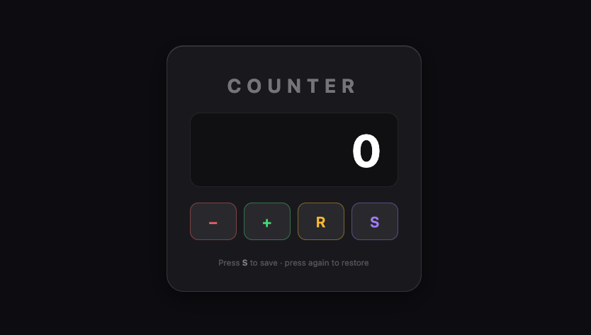

# Counter JS

A simple interactive counter web app built with vanilla JavaScript, HTML, and SCSS.Counter JS is a simple and responsive web application that allows users to increment, decrement, and reset a counter value. Users can also save the current value and display it separately. The app is built with vanilla JavaScript, using dynamic DOM manipulation, and styled with SCSS for a clean and modern look. The project is fully responsive across mobile, tablet, and desktop devices.

## 🚀 Live Demo

[counte-rj-lime.vercel.app](https://counter-js-lime.vercel.app/)

## 📸 Preview




## 📋 Features

- Increment, decrement and reset the counter
- Save the current value and display it separately with doubleclick function
- Fully responsive design (mobile, tablet, desktop)
- DOM built dynamically with JavaScript

## 🛠️ Tech Stack


## 📁 Project Structure

```
counter-app/
├── index.html
├── assets/favicon/
├── css/
│ └── global.css
├── js/
│ ├── dom.js
│ ├── counter.js
│ └── app.js
├── scss/
│ ├── global.scss
│ ├── abstracts/
│ │ ├── _variables.scss
│ │ └── _mixins.scss
│ ├── base/
│ │ └── _reset.scss
│ ├── components/
│ │ ├── _counter.scss
│ │ └── _button.scss
│ └── layout/
│ └── _background.scss
└── README
```

## 👤 Author

gcangemi1997-coder – [GitHub](https://github.com/gcangemi1997-coder)
